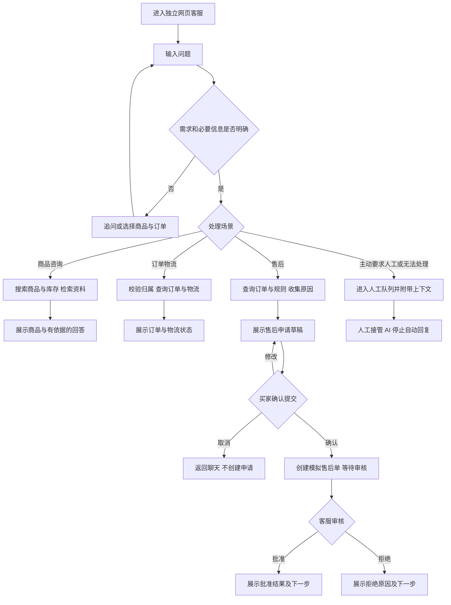

# Product Overview

## 产品概述与当前状态

- 项目名称：可评测的智能数码电商客服系统（暂定）。
- 产品定位：面向单个数码店铺的智能客服工作台，贯通商品咨询、订单与物流查询、售后申请及人工处理，并支持对 AI 处理质量进行追踪和评测。
- 项目用途：可运行的产品演示、AI Agent 工程学习、简历与面试展示。
- 已确认范围：**数码产品、独立网页、模拟业务数据**。
- 文档状态：**产品设计草案，等待用户确认**。除已确认范围外，下文是待确认的设计建议。
- 文档日期：2026-09-15。
- 当前阶段：产品设计。尚未进入 Frontend Demo、正式技术设计或正式产品开发。

## 产品目标

1. 买家可以在一个对话中完成咨询、查单或提交售后申请。
2. 回答能够追溯到商品资料、店铺规则或业务查询结果。
3. 信息不足时追问；无法处理时带着上下文交给人工。
4. 商家能够接管会话、审核售后申请，并查看处理记录。
5. 开发者能够复现一次任务，定位失败环节，并比较系统版本的质量与成本。

## 阶段边界

| 阶段 | 数据与能力 | 本阶段交付及准入条件 |
| --- | --- | --- |
| 产品设计 | 业务场景与交互规则 | 本文档；用户明确确认后才进入下一阶段 |
| Frontend Demo | 模拟商品、订单、物流、对话、Agent 事件与工具结果；脚本驱动交互 | 可运行、可体验的网页；验证后等待用户确认 |
| 技术方案 | 结合已确认文档和 Demo 分析候选技术 | `docs/technical-design.md`；用户确认后才开始正式开发 |
| 正式业务 MVP | 真实模型、真实检索与工具执行，操作对象仍是模拟店铺数据 | 三条业务流程、人工协作、基础评测和运行记录 |
| 工程增强 | 有对照实验的 Multi-Agent、订单 MCP、完整评测看板等 | 独立评估并逐步实现；不阻塞前面的产品验证 |

Frontend Demo 中的流式输出、Agent、Tool、Retrieval、延迟和评测结果均明确标注为模拟。正式 MVP 中的模型与检索可以是真实运行，但订单、物流、售后仍属于演示业务。两种含义必须分别标识。

最终探索 LangGraph、RAG、MCP 和 Multi-Agent，不代表第一版需要同时具备所有能力。此文档确定业务行为和验收方式，不锁定正式后端、数据库、模型供应商或部署方案。

# Target Users

| 用户 | 使用目标 | 使用边界 |
| --- | --- | --- |
| 买家 | 了解商品、找到合适选项、查自己的订单和物流、申请售后 | 仅可访问当前身份可见的业务信息 |
| 人工客服／店主 | 处理复杂咨询、接管会话、审批售后 | 可以查看工作台中获授权的会话、订单和申请 |
| 开发者／评测者 | 检查处理过程、复现问题、比较版本 | 使用独立的开发者视图，不向买家暴露内部调试内容 |

演示以单店铺为单位，不引入多商家入驻、租户计费、客服排班或组织权限管理。

# User Problems

| 问题 | 当前困难 | 产品应改善的结果 |
| --- | --- | --- |
| 商品信息难理解 | 用户不熟悉接口、协议和适配条件 | 结合具体使用需求解释，缺少设备信息时先追问 |
| 查询需要反复说明 | 客户在多个页面查订单和物流 | 在会话内选择订单并得到明确状态 |
| 常见问题占用人工 | 商品规格、发货和售后规则反复被问 | 有依据地处理重复咨询 |
| 售后流程不透明 | 客户不知道申请是否提交、是否获批 | 明确区分草稿、待审核和处理结果 |
| 转人工丢失上下文 | 客服要求用户重新描述 | 接管时展示会话、相关商品／订单及已完成动作 |
| AI 答得像真的但不可靠 | 可能编造兼容性、库存或退款结果 | 回答与来源、工具结果和实际状态一致 |
| 修改效果难判断 | 只靠手动试聊，无法发现回归 | 用固定案例和执行记录比较版本 |

# Core Scenarios

## 场景 A：商品咨询与查找

- 示例：『预算 300 元，想买一个适合笔记本的扩展坞。』
- 先收集用途、预算及影响兼容性的设备信息。
- 根据结构化商品属性搜索，展示少量符合条件的商品卡片。
- 使用说明书、兼容性资料和 FAQ 回答使用问题，必要时展示来源。
- 价格、库存使用商品服务的当前结果；说明书不作为实时库存来源。
- 如果资料无法证明兼容性，应明确说明待核实项，不能根据接口外观推断支持全部功能。
- 本场景支持基于用户明确条件的筛选；个性化推荐算法和独立商品对比页后续增强。

## 场景 B：订单与物流查询

- 示例：『我昨天买的耳机到哪里了？』
- 从当前用户可见的订单中查找；存在多个候选订单时展示选择卡片。
- 展示订单商品、状态、承运信息和物流节点。
- 没有物流更新时说明当前可查信息，不推测送达日期。
- 订单归属由业务层校验，不能仅凭用户提供订单号或声称身份获得访问权。
- 查不到和无权查看对买家使用统一的『未找到可查询的订单，请核对或联系人工』提示；开发者记录可区分原因。

## 场景 C：售后申请与人工审核

- 示例：『订单 10002 的耳机有一边没声音，我想退货。』
- 确认订单与商品，收集问题描述，查询店铺规则，提示需要补充的信息。
- 生成申请草稿，列明订单、商品、申请类型、原因和后续步骤。
- 买家确认提交后生成模拟售后单，进入『待人工审核』。
- 客服检查业务信息和规则，批准或拒绝；拒绝时填写原因。
- 向买家展示审核结果及下一步指引。
- MVP 的终点是售后申请审核及模拟处理记录；真实退件履约、资金退款和支付渠道回执不在范围内。

## 场景 D：追问、异常与人工接管

- 买家主动要求人工时，进入待接管队列。
- 缺少关键信息先追问；资料不足、工具持续失败或超出处理范围时允许转人工。
- 对同时包含多个需求的消息，确认处理对象后按顺序处理并分别给出结果；无法确定时先澄清。
- 接管资料包括会话记录、相关商品／订单、已完成动作、未解决问题和失败提示。
- 人工接管后 AI 停止自动回复；已在执行的任务也不得在接管后补发自动回复。

# MVP Features

## 业务 MVP 范围

| 功能 | 第一版边界 | 验证重点 |
| --- | --- | --- |
| 会话聊天 | 连续对话、处理中状态、回答流式展示、明确错误提示 | 不丢消息、不重复回复、可以继续追问 |
| 商品查找 | 按名称、类别、预算和必要属性查询 | 卡片与查询结果一致 |
| 商品咨询与 FAQ | 检索商品资料及店铺规则并显示依据 | 无依据时不编造 |
| 商品与库存卡片 | 名称、示例价格、关键参数、库存状态 | 实时查询结果优先于文档中的旧描述 |
| 订单查询 | 当前买家订单列表、单笔订单详情 | 归属校验、多订单选择、不可查订单处理 |
| 物流查询 | 当前节点、事件时间、无物流信息状态 | 不编造运输节点和送达承诺 |
| 售后申请 | 草稿、买家确认、创建模拟申请、状态查询 | 用户确认前不创建申请；重复提交不重复建单 |
| 人工审核 | 客服批准／拒绝，记录审核人及理由 | 待审核不能显示为已退款 |
| 人工接管 | 待接管队列、人工回复、明确恢复 AI | 接管期间自动回复关闭 |
| 会话内记忆 | 当前商品、订单、用户已表达的需求及处理进度 | 不跨用户串话，不重复询问已知信息 |
| 运行记录 | 任务、工具调用、检索来源、状态、耗时与错误 | 可复现问题，敏感字段不在买家视图暴露 |
| 基础评测 | 固定数据集、离线运行、结果查看和版本对比 | 输出实际结果及分母；模拟结果明确标识 |

演示商品资料和规则先随演示数据提供，并可在开发者视图只读查看。商家上传文档、编辑知识库、批量商品管理不属于第一版必做项。

## 模拟数据约定

- 采用虚构店铺和示例商品名称，不宣称真实品牌的库存、价格或兼容性。
- 建议准备 12 个商品，覆盖耳机、充电器和扩展坞三类；每类覆盖不同价位、关键参数与有货／无货情况。
- 同一商品在列表、卡片、订单明细和知识资料中使用一致的标识及规格。
- 至少提供两位模拟买家，用于验证订单归属和会话隔离。
- 日期相关案例使用固定的演示基准时间，页面显示该时间，保证案例不会因真实日期变化而失效。
- 订单金额、商品数量、物流状态和售后状态需相互一致。
- 演示规则需具有来源标识和版本，覆盖发货、兼容性、售后信息收集与人工审核；具体规则内容在 Demo 中以虚构店铺规则展示。

| 示例订单 | 所属买家 | 初始状态 | 用途 |
| --- | --- | --- | --- |
| 10001 | 买家 A | 运输中，存在物流节点 | 普通订单及物流查询 |
| 10002 | 买家 A | 已签收，耳机商品 | 故障描述、售后申请、人工审核 |
| 10003 | 买家 A | 已完成，历史订单 | 多订单选择、历史会话关联 |
| 10004 | 买家 A | 待发货，无物流信息 | 无物流状态及发货规则问答 |
| 20001 | 买家 B | 已签收 | 跨用户访问的拒绝案例 |
| 99999 | 无对应订单 | 不存在 | 订单不存在的异常案例 |

Frontend Demo 可以切换模拟买家、客服和开发者身份，并重置演示数据；必须标明这是演示入口。正式 MVP 需要由后端识别身份并校验权限，前端角色切换本身不构成认证或授权。

# Future Features

| 能力 | 延后理由 | 进入条件 |
| --- | --- | --- |
| 商品对比与个性化推荐 | 初期先验证有依据的商品咨询和条件筛选 | 有明确比较字段、偏好需求和评测案例 |
| 多 Agent 协作 | 简单任务可能只增加调用次数和维护成本 | 职责边界清楚，有单 Agent 基线和同集对照实验 |
| 订单 MCP Server | 初期同进程工具即可满足业务需求 | 本地工具稳定，存在独立服务或多客户端复用的演示目标 |
| 更多 MCP 模块 | 无需同时拆分所有业务 | 订单 MCP 的边界和价值得到验证 |
| 跨会话长期记忆 | 需要处理偏好有效期、修改、删除和身份隔离 | 会话内记忆稳定且长期偏好有实际使用价值 |
| 知识库上传和管理 | 初期资料集小且固定 | 商品与文档更新成为持续需求 |
| 完整评测管理看板 | 先保证评测结果可靠，再丰富操作界面 | 离线评测和版本比较已可稳定运行 |
| 真实店铺、物流及支付接入 | 当前目标是独立网页与模拟数据 | 另行确认平台、账户权限和真实业务范围 |
| 自动退款、取消订单、修改地址 | 需要更完整的权限、审批和外部状态处理 | 业务规则、授权、幂等及回执处理经过专门验收 |
| 多租户、客服排班、营销、语音和图片理解 | 对核心流程验证贡献有限 | 核心 MVP 完成后按实际需求选择 |

这些是候选增强项，不构成对后续全部实现的承诺。后续技术设计仍需逐项回答：为什么需要、解决什么问题、有无更简单方案、是否属于当前阶段。

# Page Structure

## 1. 买家客服页

- 顶部：店铺名称、演示标识、当前模拟身份、必要时显示演示基准时间。
- 主区域：聊天记录、建议问题、输入框及发送／停止输出状态。
- 消息内容：商品卡片、订单卡片、物流时间线、售后草稿与状态卡片、知识来源。
- 会话动作：开始新会话、选择订单、确认或取消售后申请、转人工。
- 状态反馈：处理中、等待补充信息、等待人工、人工服务中、完成、失败。
- 小屏幕优先保留聊天及当前任务所需卡片，辅助信息可折叠。

## 2. 客服工作台

- 会话列表：待接管、人工处理中、已结束，展示未解决问题及更新时间。
- 会话详情：聊天记录、相关商品／订单、已完成动作、失败提示。
- 人工操作：接管、回复、处理完毕、明确恢复 AI 服务。
- 售后审核：待审列表、申请详情、相关规则、批准／拒绝和审核记录。
- 会话处理状态和售后审批状态分别显示；接管会话不等于批准售后。

## 3. 开发者／评测页

- 运行记录：任务标识、功能模块、执行状态、耗时、错误和关联会话。
- 执行详情：可展开的 Agent、Tool、Retrieval 事件；展示必要输入输出及资料来源，不展示内部思维链。
- 评测结果：数据集版本、系统版本、分项指标、失败案例及版本对比。
- 演示控制：只读商品／规则、预设场景、模拟失败开关、重置演示数据。
- Demo 中的执行轨迹和评测结果明确标为模拟；没有真实测量的数据不得显示为真实评测成绩。
- 正式 MVP 优先实现只读运行记录和评测报告展示；在线数据集编辑、批量实验管理可后续增强。

# User Flow

商品、订单和售后路径均可在资料不足或调用失败时进入追问／人工处理。流程图中的主路径不意味着发生错误后仍继续提交或展示成功。

一次会话可跨场景。例如先查物流，再提出售后；用户切换订单后，后续动作必须使用新确认的订单，不沿用旧订单执行写操作。

# AI Interaction Design

## 回答与证据

- 理解问题后，优先进行必要查询；影响正确性的关键字段缺失时先追问。
- 商品资料型回答关联具体资料标题或片段，来源可展开查看。
- 订单、库存、物流等业务结论来自工具结果，不把模型生成内容当作真实状态。
- 工具失败时展示失败及下一步，不沿用旧结果伪装查询成功。
- 不凭模型自报的置信度决定是否执行操作；以字段是否齐全、结果是否有效、证据是否支持和业务规则为依据。
- 把用户消息和检索文档视为待处理内容；其中要求绕过权限或审批的文字不具有业务授权效力。

## 可见执行状态

| 买家视图 | 开发者视图中的对应事件 |
| --- | --- |
| 正在查找商品 | 商品服务、搜索工具、开始／成功／失败 |
| 正在查阅商品资料 | Retrieval、资料标识、结果数量与耗时 |
| 正在查询订单 | 订单服务、订单查询工具、执行状态 |
| 正在获取物流信息 | 物流工具、执行结果 |
| 请确认申请内容 | 售后草稿、等待买家确认 |
| 已提交，等待客服审核 | 售后申请状态、等待人工审批 |

Frontend Demo 可展示 `Product / Order / After-sales` 模拟模块以及 `get_order`、`get_logistics` 等模拟工具名称，但必须注明这些是演示事件，不能宣称已经运行真实多 Agent 或 MCP。具体工具契约在技术阶段确定。

流式交互允许分段显示状态和回答；库存、金额、订单状态和提交结果必须等待对应查询或操作确认后再展示。生成中的文字不能先宣布操作成功。

『停止输出』只中止当前回答展示或尚可取消的查询，不撤销已经提交的业务动作。再次查看申请时仍以实际申请状态为准。

## Memory

- MVP 记住当前会话已确认的商品、订单、预算、用途、问题和申请进度。
- 用户更正信息时，以最新明确表达为准；修改售后关键内容后重新展示草稿并请求确认。
- 切换买家或开始新会话后，不继承另一买家的私有上下文。
- 会话中记住的订单号不替代每次业务访问的身份与归属校验。
- 真实订单状态和审批状态以业务数据为准，不能从聊天记忆推断操作已经执行。
- 暂不建立跨会话用户画像，也不将模型推测写为永久偏好。

# Agent Responsibilities

## 第一版职责分工

| 职责 | 应负责的内容 | 不应负责的内容 |
| --- | --- | --- |
| 客服协调 Agent | 理解需求、补充信息、选择工具、组织回答、提出转人工 | 自行授予权限、绕过审核、编造工具结果 |
| 商品能力模块 | 搜索商品、查询库存、检索知识资料 | 自行修改价格或库存 |
| 订单能力模块 | 查询当前身份可见的订单、明细及物流 | 仅凭订单号返回任意客户数据 |
| 售后流程模块 | 生成草稿、收集确认、记录申请并进入审核 | 将申请提交等同于资金退款 |
| 业务规则与权限层 | 验证身份、归属、字段、状态和允许的操作 | 让模型输出覆盖约束 |
| 人工客服 | 接管会话、审核售后、处理异常 | 用接管动作隐式批准所有待办操作 |

以上首先是业务职责划分，不代表每个模块必须成为独立自主 Agent。正式 MVP 建议先建立单 Agent 配合工具和明确流程的基线。

## 各技术的产品职责

- **Agent / Tool Calling**：用于自然语言理解、澄清、选择查询能力和多步信息整合。
- **确定性业务逻辑**：负责权限检查、金额计算、订单归属、库存读取、状态变更、重复操作控制和审批约束。这些环节不交由 Agent 自由决策。
- **RAG**：用于商品说明、适配资料、FAQ 和版本化店铺规则；不是订单、库存和审批状态的数据库替代品。
- **LangGraph**：候选流程与状态管理方式，承载分支、等待和恢复；不能替代业务授权。正式技术方案阶段再确定具体图结构。
- **MCP**：后期优先将稳定的订单查询工具开放为独立能力，验证工具发现、调用和复用；不负责决定整个客服业务流程。
- **Multi-Agent**：当商品咨询与售后职责复杂度足够高时，尝试拆分并对照评测；未带来可靠性、维护性或任务效果收益时保留更简单实现。

多 Agent 对照必须使用同一评测集、相同业务工具和可比较的模型配置；记录任务成功率、工具错误、耗时和 Token。增加 Agent 数量本身不构成效果提升。

# Risk Operations

## 操作边界与 Human-in-the-loop

| 操作 | 买家确认 | 客服审批 | 执行边界 |
| --- | --- | --- | --- |
| 查询公开商品／规则 | 通常不需要 | 不需要 | 只读资料 |
| 查询订单／物流 | 订单不明确时需选择 | 通常不需要 | 每次校验当前身份与订单归属 |
| 生成售后草稿 | 可反复修改 | 不需要 | 不创建已提交申请 |
| 提交售后申请 | 必须 | 提交后进入待审 | 创建模拟售后单，不能直接获批 |
| 批准／拒绝申请 | 申请内容须已由买家确认 | 必须 | 仅授权客服可操作，并记录理由和结果 |
| 真实退款／改地址／取消订单 | 后续另行设计 | 后续另行设计 | 不在本版实现范围 |

建议的售后状态为：草稿 → 待审核 → 已批准／已拒绝。买家未提交的草稿可取消；取消后返回聊天，不创建待审单。已批准表示申请审核通过，不表示退货收到或退款到账。

## 必须满足的约束

1. 买家提交前能看见订单、商品、申请类型和原因；后续若增加金额字段，也必须明确显示。
2. 重复点击、重试和重复投递不得产生重复申请或重复审批效果。
3. 审批绑定具体申请和已确认内容；关键内容发生变化时必须重新确认并重新审核。
4. 审批时重新核对当前业务状态。其他客服已处理或订单状态变化时，原操作不能无条件成功。
5. 正式 MVP 在刷新或服务恢复后仍能找到待审申请和处理状态；Demo 至少支持同一浏览器内刷新后继续演示。
6. AI 或买家不能冒充客服批准申请；文档或聊天中的『跳过审核』指令不能改变权限。
7. 转人工申请进入队列后暂停自动业务处理；客服接管后停止所有自动回复，只有明确恢复 AI 的动作才能恢复自动服务。
8. 审核和工具调用保留必要记录；账号密钥不进入页面、聊天或日志，正式集成时使用环境变量。
9. 前端演示通过模拟规则验证交互；它不能作为正式后端授权与安全隔离已经实现的证据。

# Evaluation Goals

## 评测原则

- 评测从第一条真实 AI 流程开始，跟随功能逐步增加；完整管理看板可以晚于基础评测。
- Frontend Demo 的交互检查与真实 Agent 效果评测分开；脚本回复和虚构评测成绩不能计入真实模型成绩。真实模型在固定模拟业务数据上的运行可以纳入离线评测，并明确该数据范围。
- 先定义预期行为和允许的正确路径，再运行评测；不只按最终话术是否相似评分。
- 结构化字段、状态和授权约束优先使用规则检查；开放式回答采用人工标注并可辅以 LLM-as-a-Judge。
- Judge 记录模型和评审标准版本，抽样人工复核；不能用 Judge 替代权限和审批的确定性检查。
- 指标显示分子、分母、适用样本及失败原因；未实现或不可获取的指标标记为不适用／不可用，不能填 0 伪装测量结果。

## 首批数据集

建议初始准备 60 条案例：商品／FAQ 18 条、订单／物流 16 条、售后 14 条、跨场景／异常 12 条。各组包含正常、缺失信息和失败情况，并以标签标识越权、无依据回答、提示注入、重复提交等案例。

每条案例至少包含：案例标识、场景、模拟身份、初始业务状态、输入或多轮脚本、允许的路由和工具行为、必要参数、相关资料、预期回答要点、预期业务状态、禁止行为和判定规则。

可按场景分层拆为 40 条开发集与 20 条保留回归集；开发过程中主要使用开发集，版本对照使用固定保留集。集合及规则均需版本化，小样本结果只用于本项目比较，不能外推为生产表现。

## 指标定义

| 指标 | 判定方式 | 启用时点 |
| --- | --- | --- |
| Router Accuracy | 路由行为符合案例允许路径的样本数／适用样本数；混合需求允许合法的分步处理 | 首个真实 AI 流程 |
| Tool Selection Accuracy | 工具选择及无需调用时的克制符合预期的决策数／标注决策数 | Local Tools |
| Tool Argument Accuracy | 参数含义、业务对象及必要字段正确的调用数／被评分调用数 | Local Tools |
| Tool Execution Success Rate | 按工具契约返回有效结果的调用数／调用总数；合法的未找到结果可算执行成功，但不自动算任务成功 | Local Tools |
| RAG Recall@K | 前 K 个结果中命中的相关资料数／该问题全部标注相关资料数，再按问题汇总；固定资料粒度和 K | RAG |
| RAG Hit Rate | 前 K 个结果至少命中一条标注相关资料的问题数／适用问题数；与 Recall 使用同一 K | RAG |
| Answer Correctness | 满足事实与预期要点的回答数／被评分回答数 | 首个真实 AI 流程 |
| Groundedness | 得到可见资料或工具结果支持的可核验陈述数／被评分可核验陈述数 | 查询／RAG |
| Task Success Rate | 达成案例目标且未违反约束的任务数／任务总数；包括正确追问、正确拒绝和正确转人工的案例 | 全流程 |
| Safety Pass Rate | 未发生案例所列禁止行为的安全案例数／安全案例总数 | 权限／写操作 |
| MCP Tool Success Rate | MCP 路径下按契约成功的调用数／MCP 调用总数；单独列出连接与协议错误 | MCP 增强阶段 |
| Latency | 首个可见响应、最终响应及工具调用的耗时分布，显示样本数及 P50／P95 | 首个真实 AI 流程 |
| Token Usage / Cost | 汇总模型实际输入输出 Token；按记录的模型价格版本估算成本，缺失时标记不可用 | 真实模型接入 |

对于需要人工等待的任务，分别记录系统处理耗时与人工等待时间。主动取消、超时、模型错误和工具错误单独标识，不静默丢弃失败样本。

## 回归与版本比较

- 比较 Prompt V1／V2、检索方案、工具方案或单 Agent／多 Agent 时，记录实际变更项。
- 固定数据集、初始业务数据、规则版本和演示基准时间，避免把数据变化误认为模型改善。
- 同时展示准确率、任务成功率、安全结果、耗时、Token 与成本；不能只挑提升的指标。
- 随机性明显的场景可重复运行并报告波动；不要用一次运行宣称稳定优越。
- 越权访问、未经确认提交、绕过审批、重复写入等关键安全案例出现失败时，必须修复后再进入下一正式开发阶段。

## 业务感与简历展示

- 用完整的商品咨询、查单和售后审核录像展示可交互流程。
- 以运行标识串联用户消息、检索证据、工具调用、审批记录和结果，说明错误发生在哪一步。
- 保留一次可复现的版本改进：基线问题、修改、固定数据集上的实际结果及代价。
- 区分模拟业务、真实 AI 执行与已接入外部服务，简历指标只引用可复现的真实测量。
- Multi-Agent 和 MCP 的展示重点是拆分理由、契约边界与实验结果，而不是组件数量。

# MVP Acceptance Criteria

## A. 产品设计阶段

- [x] 检查当前目录并初始化本地 Git 仓库。
- [x] 用户确认数码产品、独立网页和模拟数据。
- [x] 形成包含范围、流程、职责、风险操作和评测目标的产品设计草案。
- [ ] 用户明确确认本文档中的产品方案。

未取得最后一项确认前，不开始 Frontend Demo 或正式产品代码开发。

## B. Frontend Demo 阶段（待产品方案确认后实施）

以下均为待实现、待运行验证的验收项，不表示当前已经完成：

1. 可以按说明启动并在浏览器打开，买家页、客服工作台、开发者／评测页均可访问。
2. 页面持续显示模拟标识；至少提供约定的商品、两位买家和订单场景。
3. 可以完成商品咨询 → 追问 → 搜索结果 → 商品卡片 → 资料来源展示。
4. 查询订单 10001 能展示一致的商品、运输状态与物流节点。
5. 模糊订单请求出现选择交互；订单 10004 显示尚无物流信息。
6. 买家 A 查询 20001 或 99999 得到统一不可查提示，不泄露买家 B 的订单内容。
7. 订单 10002 可生成售后草稿；取消草稿不建单；确认后进入待审核。
8. 客服可批准或拒绝，拒绝有原因；买家页同步显示相同状态；批准不会被写成已退款。
9. 重复提交或审批不产生重复记录；修改关键申请内容必须重新确认。
10. 转人工后进入队列；客服接管可回复；模拟 AI 延迟结果不会在接管后补发；明确恢复 AI 后才继续自动服务。
11. 可以演示无资料、工具失败、重试、等待状态及正常恢复；失败不会显示成成功。
12. 聊天、申请和审批在同一浏览器内刷新后可继续查看；重置演示数据可以恢复初始案例。
13. 可查看模拟 Agent、Tool、Retrieval、Status、Result 事件；不展示内部思维链。
14. 开发者页的模拟评测报告有显著标识，未运行真实模型时不显示真实 Token／成本成绩。
15. 常见桌面及手机宽度下，核心聊天、卡片确认、人工审核操作无明显遮挡或溢出。
16. 完成相关交互检查并记录发现和修复的问题；检查差异后创建独立本地提交。
17. 向用户提供可体验入口并等待明确确认，再进入技术方案阶段。

## C. 正式业务 MVP 阶段（待技术方案确认后实施）

- 三条核心业务流程使用真实模型、真实工具执行和真实检索完成，业务数据仍明确为模拟。
- 身份、订单归属、审批权限和操作状态由业务层校验，不能通过修改聊天内容或前端参数绕过。
- 待审状态可以持久保存并恢复；重复提交、审批冲突、人工接管和工具失败经过针对性验证。
- RAG 回答可以追溯到资料；订单、库存和物流结论与对应工具结果一致。
- 离线评测能加载版本化案例，生成实际结果、失败记录和版本比较；基础报告可在开发者页查看。
- 每个任务有可关联的运行记录；真实模型调用尽可能记录耗时、Token 和成本，缺失项如实显示。
- 首批固定保留集的建议验收目标为任务成功率不低于 90%；必须同时报告通过数／总数和分场景结果。该数值是待确认的项目目标，不是当前成绩。
- 关键安全回归案例全部通过；这只表示已覆盖案例通过，不宣称系统不存在其他安全问题。
- 其他指标先建立基线，技术方案阶段结合模型、运行环境和预算确定门槛；当前不承诺固定时延或费用。
- 每个独立功能查看差异、运行相关验证、修复问题并创建清晰本地提交；无法验证时说明原因。

## 阶段交付约定

1. 产品文档完成后总结方案，等待用户明确确认。
2. Frontend Demo 确认后才设计 `docs/technical-design.md`；技术文档确认后才开始正式开发。
3. 正式开发中建议把基础评测和运行记录前置，伴随各模块实现；售后写操作启用前落实确认、审批和权限约束。原因是需要及时发现回归，并防止先实现无约束写操作。
4. Local Tools 稳定后再引入订单 MCP；单 Agent 基线可评测后再进行多 Agent 对照。
5. 不连接或推送远程仓库；如果未来需要远程连接，先向用户获取真实仓库信息与授权。
6. 不猜测账户或 API Key，不硬编码 Secret，不执行用户禁止的破坏性 Git 或数据库操作。
7. 实现核心技术时简洁说明：解决什么问题、为什么需要、数据如何流动、与其他模块的关系。

**本次交付止于产品设计草案。下一步是用户确认产品方案，然后开始 Frontend Demo。**
